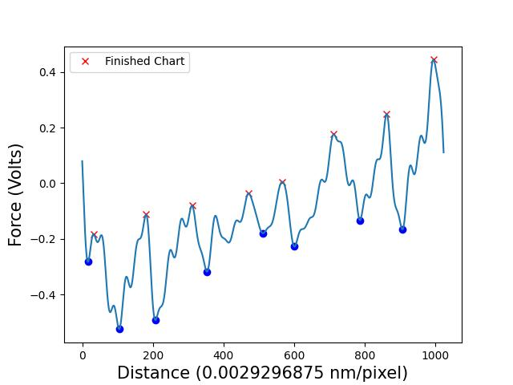
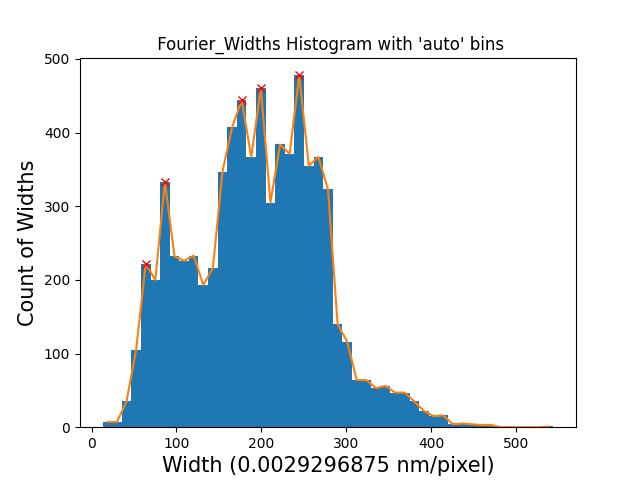

# AFM Peak Detection

## General Description
This code is meant to automate the process of finding peaks and valleys in AFM data and do all the needed math, turning hours or days of work into under a minute of computing. This work was done under the guidance of [Dr. Philip Egberts](https://schulich.ucalgary.ca/contacts/philip-egberts).

### What It Does
This code does automatic peak detection and processing for data out of an [Atomic Force Microscopy](https://en.wikipedia.org/wiki/Atomic_force_microscopy) machine. The steps are as follows:
* Recieve the data in a CSV file, with each row being a pass on the sample
* The data is quite noisy when receive, therefore it is cleaned with four filters: linear moving average filter, geometric moving average, exponential moving average filter, and a fourier filter.
* Use [SciPy to find all the peaks and valleys](https://docs.scipy.org/doc/scipy/reference/generated/scipy.signal.find_peaks.html) of each row of the CSV file
* Plot all steps (distance from peak to valley) and widths (distance from peak to peak) in histograms
* Use [SciPy to find the peaks](https://docs.scipy.org/doc/scipy/reference/generated/scipy.signal.find_peaks.html) on the histogram data
* Plot all the slopes in a histogram
* Return all the peaks in a dictionary

### Technologies Used
Python 3.8 is used with the following packages (all installed via ```pip install```):
* csv
* find_peaks from scipy.signal
* numpy
* matplotlib.pyplot
* pandas
* geometric_mean from statistics
* find_peaks from scipy.signal

## Terminology Explanation
This is what one row of the raw CSV data looks like when plotted:


These plots are what the above row of raw CSV data looks like when filtered by the different filters mentioned in [What It Does](###-What-It-Does):


This is a visual diagram of what steps and widths, mentioned in [What It Does](###-What-It-Does), are defined as throughout the project: 


These plots are what the peaks and valleys of the row of the filtered CSV from above will look like:




These are the histograms of the Steps, Widths, and Slopes of all 1024 lines of data in the CSV data with the peak detection algorithms:





## Usage
Use this code however you want (except for distributing closed source versions)! Please note there are a few __magic numbers__ throughout the program that are calibration values. These numbers are calibrated specifically for the data I received, and may not work on your data.

## Contact
[My Website](https://thesixtium.github.io/)

[Dr. Philip Egberts](https://schulich.ucalgary.ca/contacts/philip-egberts)

## License
[GNU GPLv3](https://choosealicense.com/licenses/gpl-3.0/): The GNU GPLv3 license is selected so you can do almost anything you want with this project, except distributing closed source versions.
